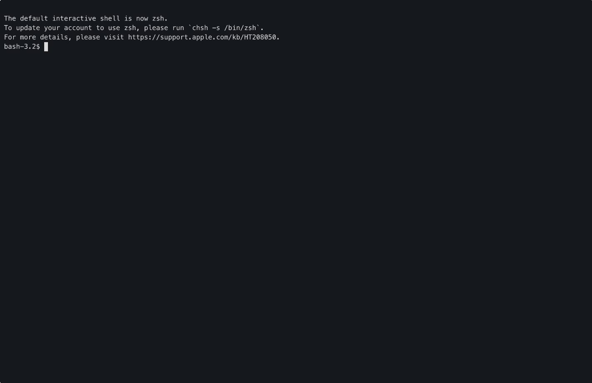

# todoctl

A CLI-first, encrypted monthly todo manager for nerdy engineers and architects.

---

## Overview

`todoctl` is designed for people who prefer:

- terminal-first workflows
- structured but lightweight task tracking
- full control over their data
- encryption by default

It is **not** a replacement for a team collaboration tool. It is a personal productivity tool.

## Demo



---

## Features

- 🔐 Password-based encryption (scrypt + ChaCha20-Poly1305, versioned blob format)
- 📅 Monthly task separation
- 🧠 Status-driven workflow (OPEN, DOING, SIDE, DONE)
- 🧾 Stable task IDs
- 🧹 Automatic sorting
- ✍️ Native `vim` / `$EDITOR` editing
- 🧩 Shell integration (auto-installed)
- ⚡ Shell completion (auto-installed)
- 🔄 Session-based password caching (per shell, secure fallback IDs)
- 💾 Backup support (sanitized metadata, in-memory manifest)
- 🧼 Clean uninstall (`todo purge --uninstall`)
- 🛡 Hardened editing mode (RAM-backed temp files)
- 🍎 macOS RAM disk helper (`todo ramdisk-create`)

---

## Security Highlights

- Modern authenticated encryption (ChaCha20-Poly1305)
- Memory-hard key derivation (scrypt, versioned parameters)
- No plaintext passphrase via environment variables
- Sanitized subprocess environments (editor isolation)
- Atomic file writes to prevent corruption
- Strict path validation for storage operations
- Secure session handling with random identifiers
- Hardened editor mode with reduced persistence

### ⚠️ Important Recommendation

For maximum security, it is **strongly recommended** to enable hardened editing mode using a RAM-backed temporary directory.

On macOS:

```bash
todo ramdisk-create
```

On Linux, `/dev/shm` is typically suitable.

This ensures that decrypted todo content:

- never touches disk
- is not recoverable after editing
- avoids editor swap/backup leakage

---

## Installation (macOS & Linux – user-wide)

The recommended way to install `todoctl` is via pipx.

### 1. Install pipx

macOS:

```bash
brew install pipx
pipx ensurepath
```

Ubuntu / Debian:

```bash
sudo apt update
sudo apt install pipx
pipx ensurepath
```

Reload your shell:

```bash
exec $SHELL
```

---

### 2. Install todoctl

```bash
pipx install todoctl
```

or:

```bash
pipx install git+https://github.com/epik0r/todoctl.git
```

---

### 3. Verify

```bash
todo --help
```

---

## First Run Behavior

On first `todo init`, the tool installs:

- shell session integration
- shell completion
- vim integration

Then reload your shell:

```bash
source ~/.bashrc
# or
source ~/.zshrc
```

---

## Usage

```bash
todo init
todo list
todo edit
todo add "Task"
todo doing 1
todo done 1
todo remove 3
todo rollover 03 04
todo backup
todo doctor
todo purge --yes
```

---

## Security Model

- encrypted at rest
- no plaintext persistence (with hardened mode)
- session-scoped secrets
- configurable security level

---

## License

GPLv3
